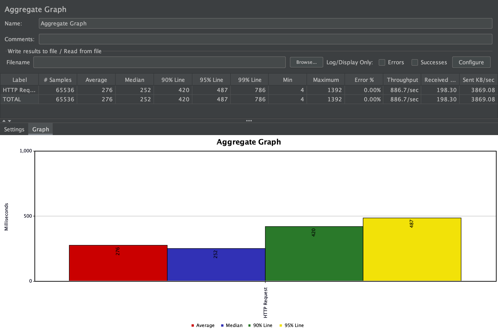
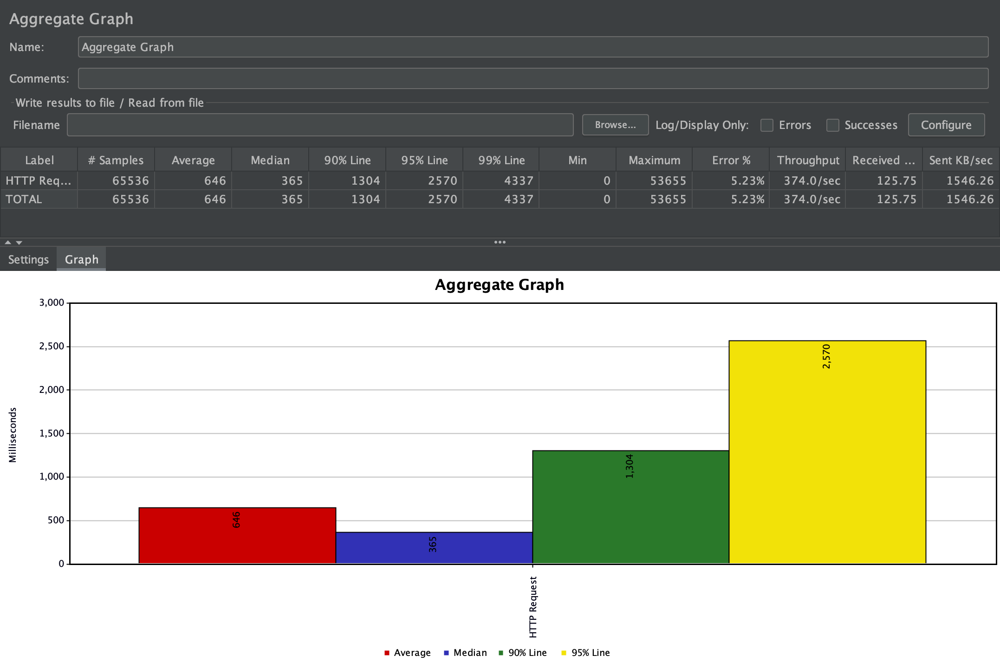
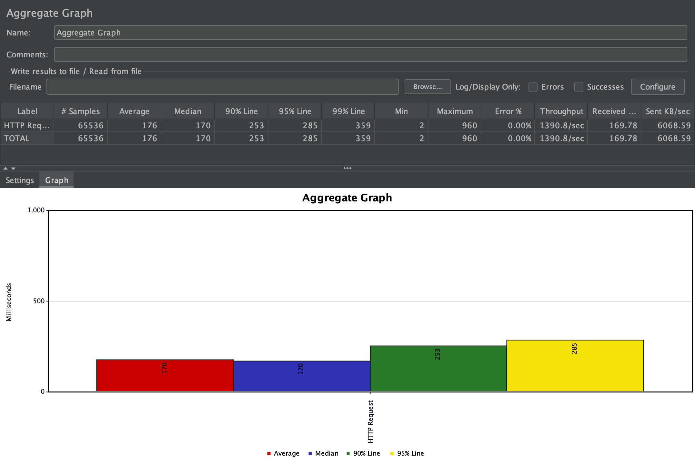
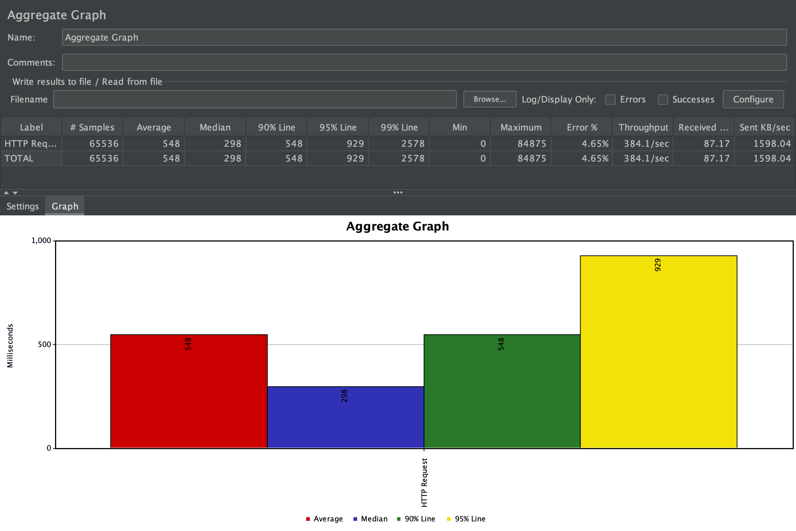
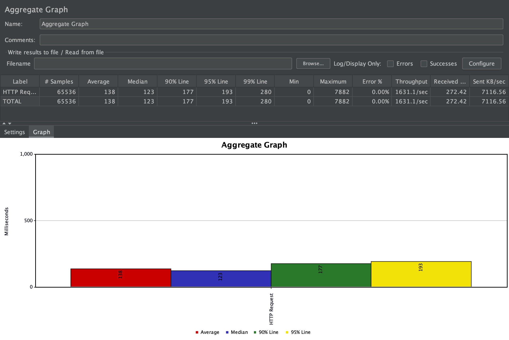
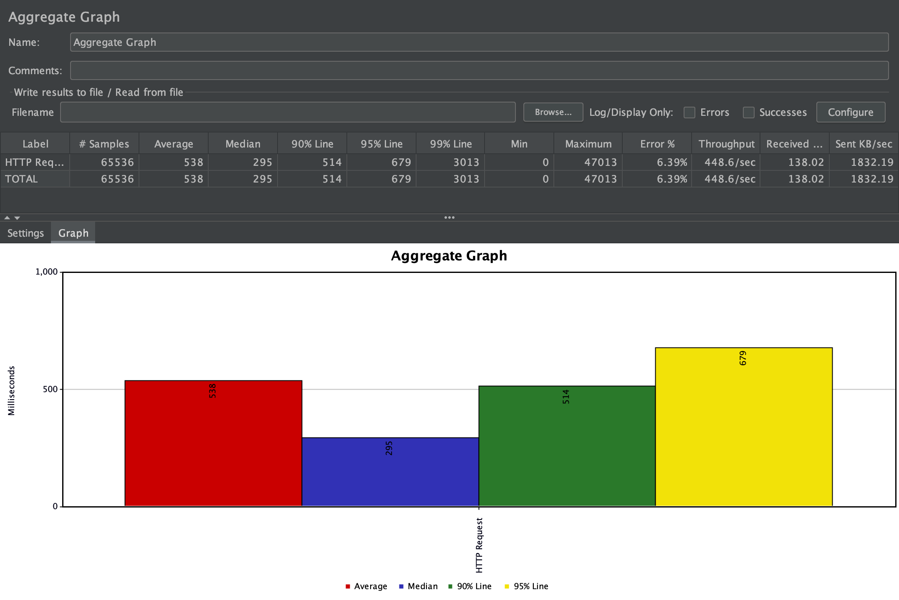

# Environment

- MacbookPro Early 2015
- 2.7 GHz Dual-Core Intel Core i5
- 8GB 1867 MHz DDR3

# JMeter Setup

- 256 threads
- 1 second ramp-up
- 256 loop count
- keep session (keep-live?) vs new session
- end point `/v2/trace`
- ~4K sample zipkin payload `https://zipkin.io/pages/data_model.html`
```
[
  {
    "traceId": "5982fe77008310cc80f1da5e10147517",
    "name": "get",
    "id": "bd7a977555f6b982",
    "timestamp": 1458702548467000,
    "duration": 386000,
    "localEndpoint": {
      "serviceName": "zipkin-query",
      "ipv4": "192.168.1.2",
      "port": 9411
    },
    "annotations": [
      {
        "timestamp": 1458702548467000,
        "value": "sr"
      },
      {
        "timestamp": 1458702548853000,
        "value": "ss"
      }
    ]
  },
  {
    "traceId": "5982fe77008310cc80f1da5e10147517",
    "name": "get-traces",
    "id": "ebf33e1a81dc6f71",
    "parentId": "bd7a977555f6b982",
    "timestamp": 1458702548478000,
    "duration": 354374,
    "localEndpoint": {
      "serviceName": "zipkin-query",
      "ipv4": "192.168.1.2",
      "port": 9411
    },
    "tags": {
      "lc": "JDBCSpanStore",
      "request": "QueryRequest{serviceName=zipkin-query, spanName=null, annotations=[], binaryAnnotations={}, minDuration=null, maxDuration=null, endTs=1458702548478, lookback=86400000, limit=1}"
    }
  },
  {
    "traceId": "5982fe77008310cc80f1da5e10147517",
    "name": "query",
    "id": "be2d01e33cc78d97",
    "parentId": "ebf33e1a81dc6f71",
    "timestamp": 1458702548786000,
    "duration": 13000,
    "localEndpoint": {
      "serviceName": "zipkin-query",
      "ipv4": "192.168.1.2",
      "port": 9411
    },
    "remoteEndpoint": {
      "serviceName": "spanstore-jdbc",
      "ipv4": "127.0.0.1",
      "port": 3306
    },
    "annotations": [
      {
        "timestamp": 1458702548786000,
        "value": "cs"
      },
      {
        "timestamp": 1458702548799000,
        "value": "cr"
      }
    ],
    "tags": {
      "jdbc.query": "select distinct `zipkin_spans`.`trace_id` from `zipkin_spans` join `zipkin_annotations` on (`zipkin_spans`.`trace_id` = `zipkin_annotations`.`trace_id` and `zipkin_spans`.`id` = `zipkin_annotations`.`span_id`) where (`zipkin_annotations`.`endpoint_service_name` = ? and `zipkin_spans`.`start_ts` between ? and ?) order by `zipkin_spans`.`start_ts` desc limit ?",
      "sa": "true"
    }
  },
  {
    "traceId": "5982fe77008310cc80f1da5e10147517",
    "name": "query",
    "id": "13038c5fee5a2f2e",
    "parentId": "ebf33e1a81dc6f71",
    "timestamp": 1458702548817000,
    "duration": 1000,
    "localEndpoint": {
      "serviceName": "zipkin-query",
      "ipv4": "192.168.1.2",
      "port": 9411
    },
    "remoteEndpoint": {
      "serviceName": "spanstore-jdbc",
      "ipv4": "127.0.0.1",
      "port": 3306
    },
    "annotations": [
      {
        "timestamp": 1458702548817000,
        "value": "cs"
      },
      {
        "timestamp": 1458702548818000,
        "value": "cr"
      }
    ],
    "tags": {
      "jdbc.query": "select `zipkin_spans`.`trace_id`, `zipkin_spans`.`id`, `zipkin_spans`.`name`, `zipkin_spans`.`parent_id`, `zipkin_spans`.`debug`, `zipkin_spans`.`start_ts`, `zipkin_spans`.`duration` from `zipkin_spans` where `zipkin_spans`.`trace_id` in (?)",
      "sa": "true"
    }
  },
  {
    "traceId": "5982fe77008310cc80f1da5e10147517",
    "name": "query",
    "id": "37ee55f3d3a94336",
    "parentId": "ebf33e1a81dc6f71",
    "timestamp": 1458702548827000,
    "duration": 2000,
    "localEndpoint": {
      "serviceName": "zipkin-query",
      "ipv4": "192.168.1.2",
      "port": 9411
    },
    "remoteEndpoint": {
      "serviceName": "spanstore-jdbc",
      "ipv4": "127.0.0.1",
      "port": 3306
    },
    "annotations": [
      {
        "timestamp": 1458702548827000,
        "value": "cs"
      },
      {
        "timestamp": 1458702548829000,
        "value": "cr"
      }
    ],
    "tags": {
      "jdbc.query": "select `zipkin_annotations`.`trace_id`, `zipkin_annotations`.`span_id`, `zipkin_annotations`.`a_key`, `zipkin_annotations`.`a_value`, `zipkin_annotations`.`a_type`, `zipkin_annotations`.`a_timestamp`, `zipkin_annotations`.`endpoint_ipv4`, `zipkin_annotations`.`endpoint_port`, `zipkin_annotations`.`endpoint_service_name` from `zipkin_annotations` where `zipkin_annotations`.`trace_id` in (?) order by `zipkin_annotations`.`a_timestamp` asc, `zipkin_annotations`.`a_key` asc",
      "sa": "true"
    }
  }
]
```


# Comparison: NodeJS vs Go vs Nginx on docker alphine

Image Size
```
REPOSITORY                     TAG                 IMAGE ID            SIZE
alamusi/mock_sfx               latest              cb91f874dc07        91MB
wxy325/mock_sfx                latest              d9036dd3d04f        13.4MB
nginx                          1.18.0-alpine       8c1bfa967ebf        21.5MB
```


## NodeJS Express Mock

### build
```
docker build -t alamusi/mock_sfx .
```

### run
Default config
```
docker run -p 3000:3000 --env PORT=3000 -it --rm --name mock_sfx_node alamusi/mock_sfx
```

Increase file handler limit
```
docker run -p 3000:3000 --ulimit nofile=262144:262144 -it --rm --name mock_sfx_node alamusi/mock_sfx
```




## Go Mock

### run
Default config
```
docker run -p 3000:3000 --env PORT=3000 -it --rm --name mock_sfx_go wxy325/mock_sfx
```





## NGINX Mock

### run
Default config
```
docker run -p 3000:3000 -v /Users/alamusi/perf-test/nginx.conf:/etc/nginx/nginx.conf:ro -it --rm --name mock_sfx_nginx nginx:1.18.0-alpine
```

Increase worker limits
```
docker run -p 3000:3000 -v /Users/alamusi/perf-test/nginxmax.conf:/etc/nginx/nginx.conf:ro -it --rm --name mock_sfx_nginx nginx:1.18.0-alpine
```




